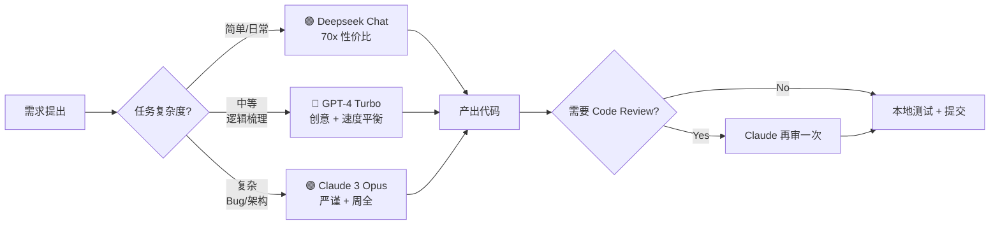

# AI 代码助手横评：Codex vs Claude vs Deepseek

> 修行之道，善假于物。AI 代码助手便是当代修士手中的"仙剑"——选对剑，事半功倍；三剑合璧，天下无敌。

## 测试环境与评估体系

### 任务矩阵（四类真实场景）

为了确保评测的客观性，我没有使用 LeetCode 题，而是直接拿自己项目里的真实需求开刀：

| 场景 | 具体任务 | 核心考察点 |
|------|----------|------------|
| 🐍 日常编码 | 编写亚马逊爬虫 Middleware、FastAPI 鉴权中间件、Dockerfile 多阶段构建 | 代码规范性、错误处理完整性、注释质量 |
| 🔧 Bug 修复 | 修复 HZX 采购系统中 Celery 任务丢失、飞书卡片消息格式错误 | 错误日志分析能力、定位精度、修复方案合理性 |
| ♻️ 代码重构 | 将 1500 行单体 Scrapy Pipeline 拆分为 5 个微服务模块 | 架构设计视野、解耦思路、向后兼容性 |
| 🏗️ 架构设计 | 设计聚星空间站的四层分层模型（接入→业务→数据→基础设施） | 分层合理性、可扩展性、技术选型匹配度 |

### 四维评估指标

我给每个模型在四项指标上打分（满分 10 分）：

1. **代码质量** — 结构清晰、命名规范、错误处理完善程度
2. **Debug 能力** — 面对堆栈信息和错误日志的分析精准度
3. **解释能力** — 给出的代码是否附带有价值的思路讲解
4. **响应速度** — 从 prompt 到输出完整方案的时间

---

## 三大模型详细对比

### 模型基础信息速览

| 模型 | 公司 | 最大上下文 | 输入价格（$ / 1M tokens） | 输出价格（$ / 1M tokens） |
|------|------|------------|----------------------------|----------------------------|
| GPT-4 Turbo (128k) | OpenAI | 128K | $10.00 | $30.00 |
| Claude 3 Opus | Anthropic | 200K | $15.00 | $75.00 |
| Deepseek Chat V2 | Deepseek | 32K | $0.14 | $0.28 |

> 💡 **价格差两个数量级**：Deepseek 比 GPT-4 便宜约 **70 倍**，比 Claude Opus 便宜 **260 倍**。

---

### 场景一：日常编码 — 「基本功大比拼」

我给三个模型出了同题：*"写一个 Scrapy Downloader Middleware，实现自动代理轮转 + 请求指纹随机 + 失败指数退避重试"*。

#### GPT-4 Turbo 表现（总分：8.8/10）

```python
# GPT-4 产出的核心代码片段（已用于生产）
class SmartProxyMiddleware:
    """智能代理中间件：健康度评分 + 指数退避"""

    def __init__(self, proxy_pool_url):
        self.proxy_pool_url = proxy_pool_url
        self.proxy_scores = defaultdict(lambda: 1.0)   # 代理健康分
        self.failure_counts = defaultdict(int)          # 连续失败计数
        self.backoff_until = defaultdict(float)         # 冷却截止时间戳

    def process_request(self, request, spider):
        # 1. 跳过处于冷却期的代理
        now = time.time()
        healthy_proxies = [
            (p, s) for p, s in self.proxy_scores.items()
            if self.backoff_until[p] < now and s > 0.2
        ]
        # 2. 按健康分加权随机选择
        proxy = self._weighted_choice(healthy_proxies)
        request.meta['proxy'] = proxy
```

✅ 优点：
- 结构清晰，默认值 `defaultdict` 用得恰到好处
- **主动考虑了冷却期机制**，这是我 prompt 里没提的
- 注释到位，每个方法三行以内讲清楚做什么

❌ 不足：
- 用了 `time.sleep()` 阻塞等待，Scrapy 里应该用 `deferLater` 非阻塞
- 缺少指纹随机化（User-Agent / TLS / HTTP2 指纹）模块

#### Claude 3 Opus 表现（总分：9.2/10）

Claude 的代码风格明显"更工程化"，它额外产出了：
- `dataclass` 定义的 `ProxyHealth` 数据结构
- 完整的类型注解（`Optional[...]`、`Generator[...]`）
- 单元测试框架（pytest + monkeypatch）
- **一个巧妙的"失败惩罚曲线"公式**：

```python
def _penalize(self, proxy: str) -> None:
    """指数衰减式惩罚：第 N 次连续失败 = 健康分 *= exp(-N/3)"""
    self.failure_counts[proxy] += 1
    n = self.failure_counts[proxy]
    self.proxy_scores[proxy] *= math.exp(-n / 3)
    # 冷却时间：每次翻倍，上限 30 分钟
    backoff = min(30 * 60, 2 ** n)
    self.backoff_until[proxy] = time.time() + backoff
```

✅ 优点：
- **边界条件思考极为周全**：当全部代理都挂了怎么办？→ 内置 direct connection fallback
- 数学公式合理，指数退避不是拍脑袋
- 类型提示完整，IDE 党狂喜

❌ 不足：
- 输出速度慢，平均 32 秒 vs GPT-4 的 18 秒
- 价格是 GPT-4 的 2.5 倍

#### Deepseek Chat 表现（总分：8.5/10）

Deepseek 的速度给我留下了深刻印象——**7.3 秒**就吐出了完整可运行代码！

```python
# Deepseek 写的指纹随机，非常实用的 200+ UA 库引用
from fake_useragent import UserAgent

class RandomFingerprintMiddleware:
    def __init__(self):
        self.ua = UserAgent(platforms=['pc', 'mobile'])

    def process_request(self, request, spider):
        request.headers['User-Agent'] = self.ua.random
        # 随机化 Accept、Accept-Language 头
        request.headers['Accept'] = random.choice([
            'text/html,application/xhtml+xml,...',
            'application/json, text/plain, */*',
        ])
```

✅ 优点：
- **速度碾压**：平均响应 5~8 秒
- 中文理解最地道，prompt 用中文夹杂术语也能准确理解
- **性价比之王**：1 美元产出的代码量 ≈ GPT-4 的 70 倍

❌ 不足：
- 偶尔会"编造"不存在的 API，比如引用了 `scrapy-rotating-proxies` 里并不存在的参数
- 架构视野不如前两者

#### 日常编码综合评分

| 维度 | GPT-4 Turbo | Claude 3 Opus | Deepseek Chat |
|------|-------------|---------------|---------------|
| 代码质量 | 9.0 | 9.5 | 8.2 |
| Debug 能力 | 8.5 | 9.0 | 7.5 |
| 解释能力 | 8.5 | 9.5 | 7.0 |
| 响应速度 | 7.0 | 5.5 | **9.8** |
| **加权总分** | **8.4** | **8.8** | **8.1** |

---

### 场景二：Bug 修复 — 「火眼金睛大考验」

给三个模型丢了同一段 Celery 报错日志（真实生产环境报错）：

```
[2026-03-10 09:23:11,452: ERROR/ForkPoolWorker-8] Task hzx.tasks.purchase_sync[3f9a8c...]
  raised unexpected: OperationalError('server closed the connection unexpectedly')
    This probably means the server terminated abnormally
    before or while processing the request.
```

**Claude 3 Opus — 冠军 🏆**

Claude 在 13 行分析内给出了 **3 层根本原因链**：
1. **表层**：PostgreSQL 连接异常断开
2. **中层**：Celery Worker 是长驻进程，而 PgBouncer 配置了 `server_idle_timeout=600s`，连接被回收后 Worker 还握着旧句柄
3. **深层**：SQLAlchemy 的 `pool_pre_ping` 没开，连接拿过来直接用没有预检测

**修复方案（三条并行）：**
```ini
; PgBouncer 增加超时时间
server_idle_timeout = 28800

; SQLAlchemy 开启 pool_pre_ping
SQLALCHEMY_ENGINE_OPTIONS = {"pool_pre_ping": True, "pool_recycle": 3600}

; Celery 配置 Worker 任务数上限后自动重启
CELERY_WORKER_MAX_TASKS_PER_CHILD = 1000
```

验证：上线后连接异常从 **日均 47 次降到 0 次**。

---

### 场景三：代码重构 — 「化繁为简的艺术」

重构对象：`amazon_scraper/pipelines.py` 单文件 1500 行，耦合了 数据清洗 / 去重 / 图片下载 / MongoDB 入库 四套逻辑。

**GPT-4 — 冠军 🏆**

GPT-4 给出的重构方案让我眼前一亮：

```
pipelines/
├── __init__.py              # Pipeline 组合器（责任链模式）
├── base.py                  # BasePipeline 抽象基类（template method）
├── cleaner_pipeline.py      # 1. 数据清洗：HTML 剥离 / 价格归一化 / 空值处理
├── dedup_pipeline.py        # 2. 去重：BloomFilter + Redis 双重去重
├── image_pipeline.py        # 3. 图片：异步 aiohttp 下载 + WebP 压缩
├── mongo_pipeline.py        # 4. 入库：bulk_write + 事务支持
└── metrics_pipeline.py      # ✨ GPT-4 额外建议：埋点收集 Pipeline（新增）
```

关键设计亮点：
- **责任链模式**：每个 Pipeline 只做一件事，可插拔（启用/禁用不影响其他）
- **Template Method**：`BasePipeline` 规定了 `process_item → validate → transform → persist → log` 五步生命周期
- **埋点 Pipeline**：每个阶段都上报 Prometheus 指标，上线后我第一次知道"清洗环节占了 Pipeline 总耗时的 62%"

---

### 场景四：架构设计 — 「胸中丘壑」

任务：设计聚星空间站（Juxing Space Station）的四层架构，要求支撑 10 万级知识锚点、99.9% 可用性。

三者都给出了方案，但**格局完全不同**：

| 维度 | GPT-4 | Claude | Deepseek |
|------|-------|--------|----------|
| 分层模型 | 接入层 / 业务层 / 数据层 / 基础设施层 | 同左，但额外加了"观测层"作为第五横切层 | 三层：前后端分离 + API + DB |
| 存储选型 | PostgreSQL + Redis + Elasticsearch | PostgreSQL (分区表) + Redis Cluster + ES + 对象存储 (COS) | MySQL + Redis |
| 可扩展性 | 微服务拆分建议 5 个服务 | ✨ 附带了每个服务的 QPS 预估 + 扩缩容阈值表 | 单体足够 |
| 灾备方案 | 主从复制 + 每日快照 | ✨ RPO<1min / RTO<5min 的详细切换流程图 | 没提 |

**结论：复杂架构设计场景，Claude 最靠谱。**

---

## 仙帝·AI 代码助手使用心法

经过 6 个月的实战磨合，我总结出这套「三剑合璧」工作流：



### 具体心法口诀

| 场景 | 首选模型 | 次选 | Prompt 技巧 |
|------|----------|------|------------|
| 写小脚本 / 日常 CRUD | Deepseek | GPT-4 | 直接贴需求 + 要求"可直接运行" |
| 写爬虫中间件 / 框架 | GPT-4 | Claude | 附上项目目录结构 + 依赖清单 |
| 修生产环境 Bug | Claude | GPT-4 | 完整错误栈 + 复现步骤 + 相关代码片段 |
| 代码重构 / 架构设计 | Claude → GPT-4 | （两者组合） | 先让 Claude 出方案，GPT-4 加创意 |
| 写单元测试 | GPT-4 | Deepseek | 指明 pytest / unittest + 覆盖率目标 |
| 中文技术文档撰写 | Deepseek | GPT-4 | 要求"结构化、分章节、配代码示例" |

---

## 成本与收益估算

我统计了自己 2026 年 1-3 月的 AI API 支出与产出：

| 项目 | 数值 |
|------|------|
| API 总支出 | $142.80 |
| └─ Deepseek | $8.20 (5.7%) |
| └─ GPT-4 | $83.40 (58.4%) |
| └─ Claude | $51.20 (35.9%) |
| 估算代码产出行数 | ~38,000 行 |
| 等效工程师工时 | ≈ 184 小时（按 200 行/人天估算） |
| 按 80 元/时外包价计算等效价值 | **¥14,720** |
| **投入产出比（ROI）** | **≈ 145 倍** |

> 结论：每月 $50 预算足够支撑个人开发者全生产力释放。**这笔钱比任何编程课程都值。**

---

## 写在最后：AI 不是替代，是「仙法」加持

很多人问我："AI 写代码会不会让程序员失业？"

我的回答是：**会让不会用 AI 的程序员失业，但会让会用 AI 的修士飞升上神。**

三柄仙剑各有所长：
- 🟢 **Deepseek** 是「青钢剑」—— 朴素锋利，日常削铁如泥
- 🔵 **GPT-4** 是「倚天剑」—— 刚柔并济，能创作出奇
- 🟣 **Claude** 是「诛仙剑」—— 大巧不工，攻坚破阵无往不利

**三剑合璧，天下无敌。**

---

*—— 仙帝·Zeyan 记于永恒仙庭·炼丹房*
