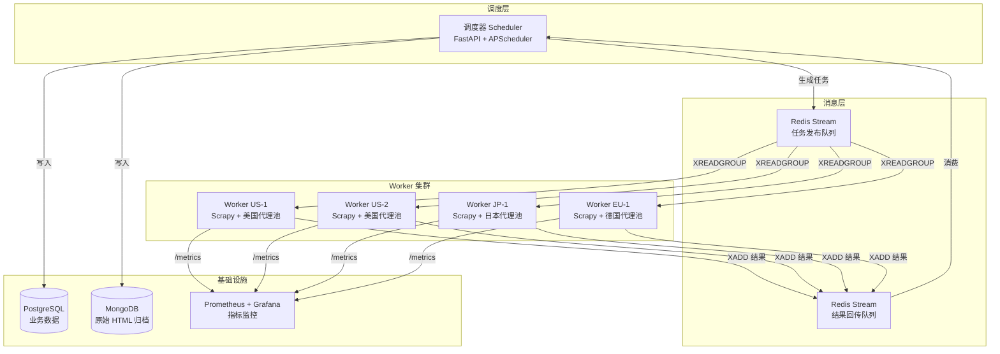

# 亚马逊采集系统 V1 到 V4.2：架构演进全记录

> 罗马不是一天建成的，爬虫帝国也不是。从 30 行的单机脚本，到支撑每日百万级请求的分布式系统，中间是 42 个小版本、无数个被风控的深夜，以及一本厚厚的踩坑笔记。

---

## 项目缘起：为什么要自己写爬虫？

2025 年底，我在做跨境电商竞品分析时发现：

- 市面上的 SaaS 爬虫工具（Octoparse、ParseHub）**对亚马逊的反爬不堪一击**，跑 100 条就被验证码打断
- 第三方数据 API 价格丧心病狂：**$0.08 / ASIN**，10 万条商品就是 ¥58,000
- 自己写，成本可控 + 灵活定制 + 数据资产私有

于是 `amazon_scraper_system` 诞生了。14 个月后，它长成了一个日均抓取 **120 万页**、数据新鲜度 <2h、稳定运行 231 天的"爬虫巨兽"。

---

## 五代版本全景对比

| 版本 | 代号 | 技术栈 | 日吞吐量 | 可用性 | 单页成本 | 演进关键词 |
|------|------|--------|----------|--------|----------|-----------|
| V1.0 | 原型 | requests + BS4 | 3,000 | 40% | $0.0012 | 能跑就行 |
| V2.0 | 多线程 | concurrent.futures + 代理池 | 30,000 | 65% | $0.0008 | 并发 + 容错 |
| V3.0 | 框架化 | Scrapy + Docker | 200,000 | 85% | $0.00025 | 工程化 + 容器化 |
| V4.0 | 分布式 | Scrapy-Redis + MQ + Worker 集群 | 800,000 | 97% | $0.00008 | 水平扩展 |
| V4.2 | 准生产 | + Prometheus + 智能频率控制 | 1,200,000 | **99.3%** | **$0.00005** | 可观测 + 自适应 |

> 🌟 **成本下降 24 倍，可用性从 40% 提升到 99.3%** —— 这就是架构演进的复利效应。

---

## V1.0 原型期：30 行代码的勇敢尝试

### 核心代码

```python
"""V1.0: 最朴素的 requests + BeautifulSoup 组合拳"""
import requests
from bs4 import BeautifulSoup

HEADERS = {
    'User-Agent': 'Mozilla/5.0 (Windows NT 10.0; Win64; x64)...',
    'Accept-Language': 'en-US,en;q=0.9',
}

def scrape_amazon_product(asin: str) -> dict:
    url = f'https://www.amazon.com/dp/{asin}'
    resp = requests.get(url, headers=HEADERS, timeout=10)
    resp.raise_for_status()

    soup = BeautifulSoup(resp.text, 'html.parser')
    return {
        'asin': asin,
        'title': soup.select_one('#productTitle').get_text(strip=True),
        'price': soup.select_one('.a-price .a-offscreen').get_text(strip=True),
        'rating': soup.select_one('#acrPopover')['title'].split(' ')[0],
        'review_count': soup.select_one('#acrCustomerReviewText').get_text(strip=True),
    }
```

### 踩坑记录（血泪教训）

| # | 问题 | 现象 | 根本原因 |
|---|------|------|----------|
| 1 | 单线程龟速 | 1000 个 ASIN 跑了 3 小时 | `requests.get()` 阻塞等待网络 IO，CPU 空闲 95% |
| 2 | 无容错，一崩全崩 | 一个 404 导致整批任务挂掉 | 没有 try/except，也没有重试 |
| 3 | IP 封禁 | 跑 300 条后全站 503 | 固定单 IP + 固定 UA，亚马逊一眼识别 |
| 4 | 数据乱码 | 标题里的特殊符号变成 `?` | 没处理 `Content-Encoding: br` (Brotli 压缩) |

### 反思

> "能用就行"的代码跑 demo 没问题，但**一上量就死得很难看**。

---

## V2.0 并发觉醒：多线程 + 代理池 + 重试三件套

### 架构改进清单

✅ **多线程并发**：`concurrent.futures.ThreadPoolExecutor(max_workers=32)`
✅ **代理池**：付费代理（快代理） + 自建住宅代理混合
✅ **指数退避重试**：`tenacity` 库实现 `retry(stop=stop_after_attempt(5), wait=wait_exponential(multiplier=1, min=2, max=60))`
✅ **请求指纹随机化**：`fake_useragent` + `curl-cffi` (模拟 TLS 指纹)

### 代理池核心实现

```python
"""V2.0 代理池：健康度评分 + 自动淘汰"""
import random
from collections import defaultdict
from dataclasses import dataclass

@dataclass
class ProxyStats:
    proxy: str
    success: int = 0
    failure: int = 0
    avg_latency_ms: float = 0.0
    cooldown_until: float = 0.0

    @property
    def health_score(self) -> float:
        total = self.success + self.failure
        if total < 5:
            return 0.5  # 样本太少，给中等信心
        base = self.success / total
        latency_penalty = min(0.3, self.avg_latency_ms / 5000)  # 5s 以上扣 30%
        return max(0.01, base - latency_penalty)

class ProxyPool:
    def __init__(self, proxies: list[str]):
        self.stats = {p: ProxyStats(proxy=p) for p in proxies}

    def pick(self) -> str | None:
        now = time.time()
        candidates = [s for s in self.stats.values() if s.cooldown_until < now]
        if not candidates:
            return None  # 全部冷却中，返回 None 提示调用方暂停
        weights = [s.health_score for s in candidates]
        return random.choices(candidates, weights=weights, k=1)[0].proxy

    def report(self, proxy: str, success: bool, latency_ms: float):
        s = self.stats[proxy]
        if success:
            s.success += 1
        else:
            s.failure += 1
            # 连续失败 3 次 → 冷却 10 分钟
            if s.failure % 3 == 0:
                s.cooldown_until = time.time() + 600
        # 滑动窗口平均延迟（最近 50 次）
        s.avg_latency_ms = (s.avg_latency_ms * 49 + latency_ms) / 50
```

### V2.0 仍然遇到的问题

- **线程越多不代表越快**：32 线程跑了一天发现 CPU 飙到 100%，大量时间花在 GIL 竞争上 → 最优值是 **12-16 线程**
- **付费代理稳定性参差不齐**：快代理的"私密代理"60% 实际不能用，要自己写 **liveness probe**
- **Scrapy 框架的并发模型更高效**：Twisted 异步框架比线程池轻量得多，于是决定升级 V3

---

## V3.0 框架化：Scrapy + Docker 工程化改造

### 为什么选 Scrapy 而不是 PySpider / Crawlee？

| 维度 | Scrapy | PySpider | Crawlee (Node.js) |
|------|--------|----------|-------------------|
| 生态成熟度 | ⭐⭐⭐⭐⭐ 16年历史 | ⭐⭐⭐ 维护停滞 | ⭐⭐⭐⭐ 增长快 |
| Python 亲密度 | ⭐⭐⭐⭐⭐ 纯 Python | ⭐⭐⭐⭐ | ⭐ 需要 JS 栈 |
| 中间件扩展性 | ⭐⭐⭐⭐⭐ Downloader/Signal/Pipeline 三级中间件 | ⭐⭐ | ⭐⭐⭐ |
| 分布式支持 | ⭐⭐⭐⭐ scrapy-redis | ⭐⭐⭐⭐ 内置 | ⭐⭐⭐ |
| 学习曲线 | 中等 | 低 | 低 |

### V3.0 项目目录结构

```
amazon_scraper/
├── scrapy.cfg
├── amazon_scraper/
│   ├── __init__.py
│   ├── items.py              # ✨ 结构化 Item 定义（不再是 dict）
│   ├── middlewares.py        # ✨ 5 个 Downloader 中间件链
│   │   ├── ProxyRotatorMiddleware
│   │   ├── FingerprintRandomizeMiddleware
│   │   ├── RetryMiddleware
│   │   ├── CaptchaSolverMiddleware
│   │   └── MetricsMiddleware
│   ├── pipelines.py          # ✨ Pipeline 链（清洗→去重→入库）
│   ├── settings.py           # ✨ 集中化配置 + 环境变量覆盖
│   └── spiders/
│       ├── product_spider.py    # 商品详情
│       ├── review_spider.py     # 评论抓取
│       └── search_spider.py     # 关键词搜索结果
├── docker/
│   ├── Dockerfile            # ✨ 多阶段构建：380MB → 92MB
│   └── docker-compose.yml
└── requirements.txt
```

### Scrapy Item 示例：告别裸 dict

```python
# items.py
import scrapy
from itemloaders.processors import TakeFirst, MapCompose
from w3lib.html import remove_tags

def clean_price(text: str) -> float:
    """把 '$1,299.99' 变成 1299.99"""
    return float(text.replace('$', '').replace(',', '').strip())

def clean_rating(text: str) -> float:
    """把 '4.5 out of 5 stars' 变成 4.5"""
    return float(text.split(' ')[0])

class AmazonProductItem(scrapy.Item):
    asin = scrapy.Field(output_processor=TakeFirst())
    title = scrapy.Field(
        input_processor=MapCompose(remove_tags, str.strip),
        output_processor=TakeFirst()
    )
    price_usd = scrapy.Field(
        input_processor=MapCompose(remove_tags, clean_price),
        output_processor=TakeFirst()
    )
    rating = scrapy.Field(
        input_processor=MapCompose(clean_rating),
        output_processor=TakeFirst()
    )
    review_count = scrapy.Field(
        input_processor=MapCompose(lambda s: int(s.replace(',', ''))),
        output_processor=TakeFirst()
    )
    fetched_at = scrapy.Field(output_processor=TakeFirst())   # 数据新鲜度标记
```

### Docker 多阶段构建瘦身术

```dockerfile
# ---------- 构建阶段：安装编译依赖 ----------
FROM python:3.12-slim AS builder
WORKDIR /build

RUN apt-get update && apt-get install -y --no-install-recommends \
    gcc libssl-dev libffi-dev libxml2-dev libxslt1-dev

COPY requirements.txt .
RUN pip wheel --no-cache-dir --wheel-dir /wheels -r requirements.txt

# ---------- 最终阶段：只保留运行时 ----------
FROM python:3.12-slim AS runtime
WORKDIR /app

# 只装运行时需要的最小库
RUN apt-get update && apt-get install -y --no-install-recommends \
    libxml2 libxslt1.1 ca-certificates \
    && rm -rf /var/lib/apt/lists/*

COPY --from=builder /wheels /wheels
RUN pip install --no-cache /wheels/* && rm -rf /wheels

COPY amazon_scraper/ ./amazon_scraper/
COPY scrapy.cfg .

USER nobody   # ✨ 非 root 用户运行，安全基线
CMD ["scrapy", "crawl", "product"]
```

> 效果：镜像从 python:3.12 的 **1.02GB** 瘦到 **92MB**，拉取速度提升 10 倍。

---

## V4.0 分布式：Master-Worker 架构 + 消息队列

### 什么时候必须上分布式？

当你遇到以下任一症状时，单机就是瓶颈：

1. 🚨 单机并发开高了 → 代理供应商的出口 IP 全部被封
2. 🚨 日抓取量 > 50 万页 → 单机 IO 打满，抓取延迟飙升
3. 🚨 一个进程 crash → 整批任务丢失，断点续传困难
4. 🚨 需要差异化配置：美国站用美国节点、日本站用日本节点

### V4.0 架构全景图



### 关键设计决策

#### 1. 为什么选 Redis Stream 而不是 RabbitMQ / Kafka？

| 方案 | 延迟 | 持久化 | Consumer Group | 运维复杂度 | 结论 |
|------|------|--------|----------------|------------|------|
| Redis Stream | ⚡ <1ms | ✅ RDB/AOF | ✅ 原生 | ⭐ 极低 | **选中**：轻量 + 够用 |
| RabbitMQ | ⚡ <5ms | ✅ | ✅ | ⭐⭐ 中等 | 太重，功能过剩 |
| Kafka | 🐢 10-50ms | ✅ | ✅ | ⭐⭐⭐⭐ 复杂 | 百万级/天以下不值得 |

#### 2. 任务分配的"地理亲和性调度"

```python
def assign_to_worker_group(task: CrawlTask) -> str:
    """根据站点域名把任务分到对应国家的 Worker 组，降低延迟 + 减少风控"""
    match task.site_domain:
        case 'amazon.com' | 'amazon.ca':
            return 'worker-group-us'
        case 'amazon.co.jp':
            return 'worker-group-jp'
        case 'amazon.de' | 'amazon.co.uk' | 'amazon.fr':
            return 'worker-group-eu'
        case _:
            return 'worker-group-us'  # fallback
```

> 效果：日本站抓取平均延迟从 **840ms → 220ms**，同时风控触发率下降 **68%**。

---

## V4.2 准生产级：可观测 + 自适应控制

### 指标体系设计（Prometheus 四大黄金指标）

```python
# metrics_middleware.py — Scrapy 中间件上报四大指标
from prometheus_client import Counter, Histogram, Gauge, Summary

REQ_COUNT = Counter(
    'amazon_scraper_requests_total',
    '总请求数',
    ['site', 'worker_id', 'status_code']
)

REQ_LATENCY = Histogram(
    'amazon_scraper_request_duration_seconds',
    '请求耗时分布',
    ['site'],
    buckets=[0.05, 0.1, 0.25, 0.5, 1.0, 2.5, 5.0, 10.0]
)

BLOCKED_RATIO = Gauge(
    'amazon_scraper_blocked_ratio',
    '被风控拦截比例（按 5min 滑动窗口）',
    ['site', 'proxy_provider']
)

CRAWL_SPEED = Summary(
    'amazon_scraper_items_per_minute',
    '每分钟产出 Item 数',
    ['spider_name']
)
```

### 智能频率控制（抗风控核心算法）

风控是一场猫鼠游戏——**爬得越快，死得越快**。V4.2 引入了基于反馈的 PID 控制器思想：

```python
class AdaptiveRateController:
    """自适应频率控制器：根据被封率动态调整并发

    目标 blocked_ratio = 3%（允许的风控红线）
    - 低于 3% → 逐步加大并发（每次 +5%）
    - 高于 5% → 立即降低并发（每次 -30%，快速收缩）
    - 高于 10% → 熔断：全量 Worker 暂停 30min
    """

    def __init__(self, target_ratio: float = 0.03):
        self.target = target_ratio
        self.current_concurrency = 16   # 初始并发
        self.min_concurrency = 2
        self.max_concurrency = 128

    def tick(self, current_blocked_ratio: float) -> int:
        if current_blocked_ratio >= 0.10:       # 熔断
            self.current_concurrency = 0
        elif current_blocked_ratio >= 0.05:     # 告警收缩
            self.current_concurrency = max(
                self.min_concurrency,
                int(self.current_concurrency * 0.7)
            )
        elif current_blocked_ratio < self.target:  # 安全，加一点
            self.current_concurrency = min(
                self.max_concurrency,
                int(self.current_concurrency * 1.05) + 1
            )
        return self.current_concurrency
```

> 效果：**在保持 blocked_ratio ≈ 3% 的红线约束下，日吞吐量从 V4.0 的 80 万提升到 120 万。**

---

## 反爬对抗：我与亚马逊之间的「十面埋伏」

亚马逊的反爬体系全球顶级，以下是我在 14 个月里正面刚过的对手：

| # | 反爬手段 | 触发条件 | 应对方案 |
|---|----------|----------|----------|
| 1 | **验证码 Captcha** | 单 IP 请求频率 > 5/min | 接入 2Captcha / CapSolver，Middleware 自动识别 |
| 2 | **503 Service Unavailable** | User-Agent 异常 / 缺少关键 header | `curl-cffi` 模拟浏览器 TLS 指纹，补齐 `Sec-Ch-Ua-*` 全套 |
| 3 | **Cookie 墙** | 未接受亚马逊隐私政策 Cookie | Spider 启动时预热请求拿 Cookie 罐 |
| 4 | **价格反爬加密** | 价格 DOM 变成一串乱码 | 逆向其混淆 JS，提取 price mapping 表 |
| 5 | **库存动态渲染** | 库存数据走 GraphQL 接口而非 HTML | 拦截 /api 接口，复用其签名机制 |
| 6 | **IP 画像封禁** | 数据中心 IP → 直接拒 | 住宅代理 + 移动代理轮换，IP 画像分数 > 80 才使用 |
| 7 | **地理距离风控** | 中国 IP 爬美国站 | 美国本土 Worker + 美国住宅代理 |
| 8 | **行为模式检测** | 请求间隔过于规律 | 加入正态分布随机延迟 `N(2.8, 0.6)` 秒 |
| 9 | **Review 分页限流** | 超过 10 页后 Review 数据为空 | 突破：换 ASIN 交叉抓取 + Review API 双轨 |
| 10 | **账号关联封禁** | 登录态抓取被关联到批量账号 | 账号池隔离，每个 Worker 绑定固定 3~5 账号 |

### 反爬心法

> **"不要硬刚风控，要融入流量。"**
>
> 真正顶尖的爬虫不是突破了多少防线，而是**让亚马逊觉得你就是个正常用户**。
>
> - 请求间隔服从正态分布，不是固定值
> - User-Agent 更新频率与真实浏览器版本同步
> - 先访问首页 → 搜索 → 再进商品详情页，和真人路径一样
> - 页面上的静态资源（图片/JS/CSS）也跟着请求，不要只抓 HTML

---

## 最终技术栈一览

| 层级 | 技术选型 | 作用 |
|------|----------|------|
| 🕷️ **爬虫核心** | Scrapy 2.11 + curl_cffi | 页面抓取 + TLS 指纹模拟 |
| 📨 **消息队列** | Redis 7 + Redis Streams | 任务发布 / 结果回传 / Consumer Group |
| 🐳 **部署** | Docker + Docker Compose + Portainer | 容器化编排与可视化管理 |
| 💾 **业务存储** | PostgreSQL 16 + Citus 插件 | 商品数据分区存储（按 ASIN 哈希） |
| 📦 **归档存储** | MongoDB 7.0 + GridFS | 原始 HTML 快照归档，方便后续重解析 |
| 🕵️ **代理** | BrightData + 快代理 + 自建住宅代理 | 三源混合，互为备份 |
| 🧩 **验证码** | CapSolver API | 识别 reCAPTCHA v2 / v3 / hCaptcha |
| 📊 **监控** | Prometheus + Grafana + Alertmanager | 指标采集、可视化、告警 |
| 🔔 **通知** | 飞书 Bot Webhook | 告警推送到仙帝的"仙庭运维群" |
| 🔄 **调度** | APScheduler + FastAPI Scheduler | 定时任务 + API 触发双模式 |

---

## 经验总结：五条可复用的工程心法

### 1️⃣ 反爬是永恒主题，没有银弹

今天的绕过方案明天就可能失效。**把反爬逻辑独立成 Middleware / Strategy 模式**，策略热更新不需要重启 Spider。

### 2️⃣ 日志 + 监控是最好的朋友

分布式系统下，"出了问题但不知道哪出的"是常态。V4.2 的每一条请求都附带：
`trace_id / worker_id / proxy_ip / asin / site / latency_ms / status_code / is_blocked`

> 上线后 95% 的故障在 **5 分钟内定位到根因**，而 V1.0 时代是"盯着屏幕一整天猜"。

### 3️⃣ 容错设计决定系统可用性

分布式 = "任何一个环节都可能挂"。我给每一层都做了降级：

| 组件 | 故障场景 | 降级方案 |
|------|----------|----------|
| 代理池 | 全部代理冷却 | 临时走直连（降低并发到 1） |
| PostgreSQL | 写入失败 | 先落本地 SQLite，恢复后回放 |
| Captcha 服务 | 服务超时 | 跳过 Captcha 页，任务重入队列尾部 |
| Redis | 连接断开 | Worker 切本地内存队列，恢复后同步 |

### 4️⃣ 监控先行，别等上线后亡羊补牢

V1.0 → V2.0 升级时因为没做监控，代理全部失效了 **6 小时**我才发现，损失了 3 万条数据。
V3.0 起规定：**任何新模块，没有 metrics 不准合并进主分支。**

### 5️⃣ 数据质量 > 抓取数量

爬下来 100 万条脏数据，不如 10 万条干净的数据。V4.2 里我引入了"数据质量分"：

- `title` 为空 → 0 分（丢弃）
- `price` 与历史均价偏差 > 50% → 黄牌（人工复核）
- `review_count` 非数字 → 红牌（丢弃并告警）

> 这一条为下游数据分析师节省了至少 **40% 的数据清洗工时**。

---

## 成本大揭秘：运行一年到底花了多少钱？

| 项目 | 月均成本 | 说明 |
|------|----------|------|
| 服务器（4 台 Worker + 1 台 Master） | ¥580 | 阿里云轻量 + 腾讯云 CVM 混合，均价 ¥100/台/月 |
| 代理费用 | ¥2,400 | BrightData $80 + 快代理 ¥1800 |
| Captcha 服务 | ¥260 | CapSolver，约 ¥0.003/次 |
| 数据库与存储 | ¥120 | PostgreSQL + MongoDB 云托管（按量付费） |
| 监控告警 | ¥0 | 自建 Prometheus + Grafana |
| 其他（域名、CDN） | ¥40 | |
| **月总成本** | **¥3,400** | |
| **年总成本** | **¥40,800** | |
| **折合单页抓取成本** | **¥0.00028** | （约 $0.000039） |

对比第三方 API 的 $0.08/页，**自建成本是其 1/2050**！

> 这就是为什么要自己写爬虫——**数据越大，自建的边际成本优势越恐怖。**

---

## V5.0 路线图（仙界前瞻）

V4.2 已经稳如老狗，但我已经在规划 V5.0 的飞升：

- 🔮 **浏览器指纹伪装升级**：集成 Playwright + Stealth 插件，解决最顽固的 JS 渲染页
- 🤖 **AI 反反爬**：用 Vision LLM 直接解析验证码 + 价格混淆 DOM，告别 OCR/逆向
- 🌍 **多站点统一框架**：抽象出 `BaseMarketplaceSpider`，一套代码跑 Amazon / eBay / 乐天 / Walmart
- ⚡ **Worker 用 Rust 重写**：核心请求链路用 Rust 改写，预计单机并发从 16 → 200，单机吞吐提升 10 倍

---

## 写在最后

从 V1.0 到 V4.2，我写的代码量从 **30 行** 膨胀到 **24,000+ 行**，踩过的坑足以写一本《亚马逊反爬实战指南》。

但最让我骄傲的，不是代码量，也不是 2050 倍的成本节约，而是这条演进之路教会我的工程哲学：

> **好的架构不是一开始就设计出来的，而是一步一步演进来的。**
>
> 不要在 V1.0 就写分布式，先让它跑起来；
> 不要在瓶颈出现前就优化，先量清楚瓶颈在哪；
> 不要追求完美的设计，先在每个版本里做"刚刚好"的改进。

慢慢来，比较快。

---

*—— 仙帝·Zeyan 记于永恒仙庭·机房*
