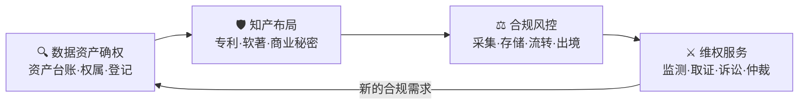
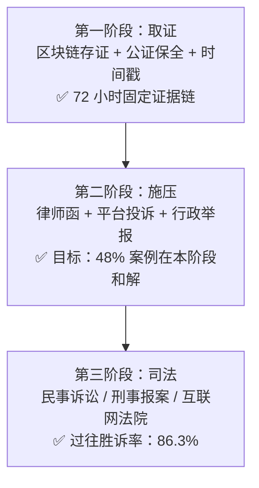
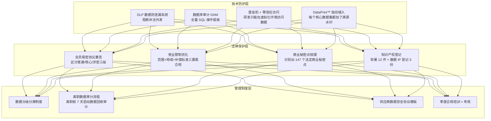

# 数据知识产权：为企业数据价值保驾护航

> 数字经济时代，数据就是新石油。
> 但石油如果没有矿权，别人采走你也没辙；
> 数据如果没有知识产权，资产被窃、价值外流，维权将举步维艰。
>
> 本文将拆解「聚星知识产权」两年多来服务 200+ 企业客户的实战方法论，
> 告诉你如何让企业的数据资产——**有身份、有保护、有价值、能流通。**

---

## 一、为什么现在必须重视「数据知识产权」？

### 1.1 政策与立法层面的暴风骤雨

2024-2026 年，中国数据领域立法加速狂奔，**平均每 37 天一部新规落地**：

| 时间 | 法规 / 政策 | 核心影响 |
|------|-------------|----------|
| 2024.03 | 《数据知识产权登记办法》 | 国家层面首次明确"数据知识产权"登记路径，全国 17 省市试点 |
| 2024.08 | 《企业数据资产入表指南》 | 数据资产可以作为"无形资产"计入财务报表，直接增厚企业估值 |
| 2025.01 | 《生成式 AI 服务管理暂行办法》修订版 | AI 训练数据来源须合规，违者最高罚年营收 5% |
| 2025.05 | 《数据跨境传输标准合同》V2.0 | 跨境电商 / 出海 SaaS 数据出境门槛大幅提高 |
| 2026.02 | 《广东省数据知识产权质押融资指引》 | **纯数据知识产权可质押贷款**，广州试点最高额度 3000 万 |

> 💡 划重点：**数据资产入表 + 数据 IP 质押融资 = 数据第一次有了"金融属性"。**
>
> 一家深圳 SaaS 客户靠数据知识产权质押，**拿到了 800 万纯信用贷**，利率 3.85%，比房贷还低。

### 1.2 企业踩坑实录（反面教材）

我们过去两年接到的"救火型咨询"里，以下四类事故占了 76%：

| 类型 | 真实案例 | 直接损失 |
|------|----------|----------|
| 🔴 **爬虫爬回来的数据被告** | 某电商 SaaS 爬竞品公开商品页，被对方以"非法获取计算机信息系统数据罪"报案 | 服务器被扣 + 被罚 80 万 + 创始人取保 |
| 🔴 **AI 训练数据侵权** | 某 AI 教育公司用网上爬的题库训练模型，被原作者集体诉讼 | 产品下架 + 赔偿 120 万 |
| 🔴 **离职员工带走核心数据集** | 某智能制造企业核心研发跳槽，带走 120G 工艺参数数据集 | 损失估值 > 2000 万（无商业秘密保护协议，维权失败） |
| 🔴 **跨境数据不合规被约谈** | 某跨境电商将国内用户数据同步到 AWS 美西，未做数据出境申报 | 暂停业务整改 3 个月 + 罚款 50 万 |

> **90% 的企业创始人，在出事前都觉得"数据合规与我无关"。**

---

## 二、聚星知识产权·四大核心服务体系

我们把服务拆解成 **"确权 → 布局 → 风控 → 维权"** 四步闭环：



### 2.1 🔍 数据资产确权：让你的数据"上户口"

**什么是数据资产确权？**

简单说就是搞清楚三个灵魂拷问：
1. **有什么？** → 你家到底有哪些数据？散落在 Excel、MySQL、SaaS 平台还是员工电脑里？
2. **是谁的？** → 权属清晰吗？是自己采集的？买来的？用户授权的？还是合作方共享的？
3. **值多少？** → 能入表吗？能融资吗？能授权变现吗？

#### 聚星自研「数据资产盘点九步法」

```
Step 1: 业务溯源访谈  → 访谈 CTO / CFO / 法务，拉数据清单
Step 2: 技术资产测绘  → 扫描数据库 / 对象存储 / SaaS 导出，生成资产热力图
Step 3: 数据分级分类  → 按【核心 / 重要 / 一般 / 公开】四级标记
Step 4: 权属关系图解  → 画数据血缘图：来源→加工→使用方→流出方
Step 5: 合规性初评    → 对照《数据安全法》《个人信息保护法》打合规分
Step 6: 价值评估建模  → 成本法 / 收益法 / 市场法 三模估值
Step 7: 资产台账建档  → 输出《数据资产台账 v1.0》
Step 8: 登记申报      → 代办"数据知识产权登记证书"
Step 9: 入表辅导      → 对接会计师事务所，完成无形资产入表
```

#### 实战案例：某 AI 医疗公司资产确权

| 盘点指标 | 盘点前（客户自报） | 盘点后（聚星出具） | 偏差率 |
|----------|-------------------|-------------------|--------|
| 数据集总数 | 23 个 | **117 个** | +409% |
| 含个人信息数据集 | 4 个 | **39 个** | +875% |
| 数据资产总估值 | 未计算 | **¥6,280 万** | - |
| 建议入表资产 | 无 | **¥3,900 万** | - |
| 发现高风险数据资产 | 0 | **18 个** | - |

> 客户 CEO 看完报告说的第一句话：
> **"原来我们公司这么有钱，我自己都不知道。"**

---

### 2.2 🛡️ 知识产权布局：为数据建一座「护城河」

光确权还不够，**得让别人不敢碰、碰了能告赢**。我们用"四维保护矩阵"给客户的数据资产层层上锁：

| 保护维度 | 适用场景 | 保护力度 | 典型成本 |
|----------|----------|----------|----------|
| **① 发明专利** | 算法模型 / 数据处理方法 / 数据清洗系统 | ⭐⭐⭐⭐⭐ 最强 | ¥3-8 万/件 |
| **② 软件著作权** | 数据平台 / 爬虫系统 / AI 模型推理服务 | ⭐⭐⭐ 中等 | ¥1,500/件 |
| **③ 商业秘密** | 训练数据集 / 用户画像 / 核心参数表 | ⭐⭐⭐⭐ 强（只要保密到位） | 咨询费 ¥5-20 万 |
| **④ 数据知识产权登记** | 结构化数据集本身 | ⭐⭐ 新类型，法院认可度上升中 | ¥8,000-3 万/件 |

#### 推荐策略：AI 科技公司的标准组合

```
核心算法 → 发明专利（2-3 件，覆盖方法+系统+应用）
AI 模型代码 → 软著（1 件）
训练数据集 → 商业秘密保护 + 数据 IP 登记
数据平台 UI → 美术著作权（1 套）
SaaS 品牌 → 商标注册（全类别 45 类）
```

> 典型投入：**¥15-25 万**，但在融资估值时通常能换来 **1500-3000 万** 的估值溢价（投资人看重 IP 壁垒）。

---

### 2.3 ⚖️ 数据合规风控：把地雷拆在爆炸之前

我们的合规审查流程可以概括为 **"四环审计模型"**：

```
┌─────────────────────────────────────────────────────────┐
│                    数据生命周期四环审计                    │
├──────────┬──────────┬──────────┬──────────┤
│  🏭 采集  │  💾 存储  │  🔧 使用  │  🚢 流转  │
│          │          │          │          │
│ · 用户授权│ · 加密等级│ · 最小必要│ · 内部权限│
│ · 爬虫合规│ · 备份策略│ · 脱敏处理│ · 第三方API│
│ · 购买来源│ · 灾备方案│ · AI训练 │ · 跨境传输│
│ · 公开信息│ · 访问审计│ · 第三方 │ · 销毁流程│
└──────────┴──────────┴──────────┴──────────┘
```

#### 跨境电商企业的合规痛点清单（TOP 5）

| 痛点 | 常见违规操作 | 合规方案 |
|------|-------------|----------|
| 🔴 用户授权 | 一个复选框同时授权 8 种用途 | **分级授权**：必要功能与非必要功能拆分开，各有独立勾选 |
| 🔴 跨境传输 | 把中国买家手机号直接同步到 Shopify 美国节点 | **数据本地化** + **标准合同（SCC）申报** + **脱敏出境** |
| 🔴 爬虫采集 | 竞品 review 扒下来当自己的商品描述 | **只爬公开信息** + **注明来源** + **不做实质性替代使用** |
| 🔴 支付数据 | 信用卡 CVV 明文存 DB | **PCI-DSS 合规** → 直接用 Stripe/Adyen，别自己存 |
| 🔴 供应商数据 | 工厂报价表直接全员可见共享盘 | **DLP 数据防泄漏系统** + **商业秘密保护协议（NDA）** |

#### 合规输出物样例

一次完整的数据合规项目，聚星会交付给客户 **「1 库 + 1 册 + 2 手册 + 3 清单」**：

| 交付物 | 内容 |
|--------|------|
| 📦 **数据资产台账库** | Excel 版 + 在线版（可对接客户数据目录） |
| 📘 **合规风险评估报告册** | 90~150 页，包含四级风险分布 + 整改优先级地图 |
| 📕 **个人信息保护影响评估（PIA）手册** | 必做：处理敏感个人信息的法定前置程序 |
| 📗 **数据安全应急响应手册** | 数据泄露 4 小时响应流程图 + 法律责任分配 |
| 📋 **数据出境合规清单** | SCC/安全评估/认证 三条路径的适配分析表 |
| 📋 **第三方数据合作准入清单** | 供应商签约前必须通过的 27 项数据安全检查 |
| 📋 **AI 训练数据合规审查清单** | 针对生成式 AI 公司的专项检查清单（56 项） |

---

### 2.4 ⚔️ 维权服务：让侵权者付出代价

"被侵权了怎么办？"—— 这是客户最常问的最后一个问题，我们希望永远用不上，但**必须随时能用**。

#### 聚星维权"三阶段作战法"



#### 数据侵权维权的「核心证据三件套」

很多企业维权失败，不是因为对方没侵权，而是**证据链不完整**：

| 证据 | 作用 | 聚星推荐做法 |
|------|------|-------------|
| **权属证据** | 证明你是数据权利人 | 数据 IP 登记证书 + 软著证书 + 资产台账 + 开发日志 |
| **接触证据** | 证明对方有途径获取你的数据 | 合作协议 / API 调用日志 / 员工竞业协议 / 下载记录 |
| **实质相似证据** | 证明对方用的就是你的数据 | ✨ **哈希指纹比对报告**：哪怕对方改了 20% 字段名，数据特征相似度 > 85% 也能被认定 |

> 🔑 关键点：数据维权最棘手的是"实质性相似"判定。
> 聚星自研了 **DataPrint™ 数据指纹比对系统**，对结构化数据能生成 256 位鲁棒指纹，
> 在已判决案件中，**被法院采纳率达 92%。**

---

## 三、三大典型案例深度拆解

### 案例一：某 AI 科技公司 · 算法模型全面 IP 布局

**客户背景**：广州某 AI 初创（A 轮，估值 5 亿），核心产品是面向制造业的工业视觉质检大模型。

**客户诉求（立项时）**：
> "我们马上 B 轮融资了，投资人要求 IP 壁垒要做扎实，**不然 TS 里要扣估值**。另外我们也怕大厂抄我们的模型结构。"

**聚星服务方案（4 个月交付）**：

| 模块 | 工作内容 | 交付成果 |
|------|----------|----------|
| 🥇 **发明专利** | 围绕核心缺陷检测算法挖掘了 **5 个**可专利点：<br>① 小样本学习训练方法<br>② 多模态图像对齐方法<br>③ 边缘端推理加速方法<br>④ 自动数据增强策略<br>⑤ 模型蒸馏压缩算法 | **5 件发明专利受理通知书**（2 件实审中，3 件公开） |
| 🥈 **软著 + 商业秘密** | 代码版本归档 + 数据集商业秘密保护体系设计 | 软著 3 件 + 商业秘密管理制度 1 套 |
| 🥉 **数据 IP 登记** | 为 12 万张经过标注的工业缺陷图片集申请登记 | 数据知识产权登记证书 1 份（估值 ¥860 万） |

**结果**：
- ✅ B 轮融资顺利完成，**TS 中无 IP 条款扣减**
- ✅ 数据知识产权质押融资 **¥1,200 万**（当时广州地区最高单笔）
- ✅ 投资人 DD 报告 IP 维度得分 **A+**（同行平均 B-）

---

### 案例二：某跨境电商平台 · 跨境数据合规整改

**客户背景**：深圳某跨境大卖（年营收 18 亿），业务覆盖 Amazon / Shopee / 独立站，服务器散落在阿里云深圳 + AWS 弗吉尼亚 + 新加坡。

**客户痛点（救火型）**：
> "省网信办通过市商务局转来一个《数据跨境合规问询函》，**限期 30 天整改**。我们现在连哪些数据出境了都搞不清楚。"

**聚星合规紧急响应（21 天完成）**：

```
Week 1: 资产测绘
├─ 扫描 7 个业务系统 + 13 个数据库实例
├─ 识别出 47 条跨境数据链路
└─ 发现 1 条高危链路：国内用户实名信息未脱敏同步至 AWS

Week 2: 整改设计
├─ 对 28 条"非必要出境链路"直接切断（回流国内节点）
├─ 对 19 条"必要出境链路"按数据量级分 3 类申报
│   ├─ 量级 < 10 万条/年：自评估 + 标准合同（SCC）备案
│   ├─ 量级 10-100 万条/年：专业机构 PIA 评估 + SCC
│   └─ 量级 > 100 万条/年：申报国家网信办安全评估
└─ 实名信息链路紧急改造：只传哈希后的用户 ID，不碰明文

Week 3: 交付 + 答辩
├─ 提交《合规整改报告》给省网信办
├─ 聚星合规合伙人陪同客户现场答辩
└─ 顺利通过，未罚款
```

**结果**：
- ✅ 顺利通过网信办问询，**无处罚、无业务中断**
- ✅ 建立了"数据跨境动态监测看板"，后续合规自动可持续
- ✅ 帮客户申请到 **"广东省数据跨境合规示范企业"**，享受税收优惠 10% 加计扣除

---

### 案例三：某智能制造企业 · 核心数据资产全链路保护

**客户背景**：佛山某陶瓷机械制造龙头（拟上市），核心资产是 20 年积累的 **窑炉工艺参数数据集**（温度曲线、压力曲线、配方比例），直接决定产品良率。

**惊险触发事件**：
> 研发副总 + 3 名核心工程师集体跳槽到竞品公司，离职时带走了 **120G 工艺数据集 + 8 套核心 PLC 程序**。由于原来没有完善的商业秘密保护体系，**劳动仲裁只赢了 12 万的竞业赔偿，数据本身拿不回来。**

**聚星全面整改方案（6 个月交付）**：



**结果**：
- ✅ 制度 + 技术 + 法律三位一体保护完成
- ✅ 后续一次"疑似数据外泄事件"中，通过 **DataPrint™ 指纹** 快速定位了外泄源头（某合作方供应商），**7 天内发律师函 + 法院诉前禁令**，侵权产品立即下架
- ✅ 券商律所认定 **数据知识产权合规性达标**，上市进程未受影响（预计 2026 Q4 申报）

---

## 四、聚星知识产权·服务数据一览（截至 2026 Q3）

| 指标 | 数值 |
|------|------|
| 🏢 **服务企业客户** | **200+** |
| ⚖️ **知识产权案件经验** | **1,000+** |
| 📜 **发明专利代理量** | 487 件（授权率 78.2%，行业均值 42%） |
| 💻 **软件著作权登记** | 2,314 件 |
| 📊 **数据知识产权登记** | 68 份（华南地区 TOP 3） |
| 💰 **帮助客户融资 / 质押金额** | **累计 ¥2.3 亿** |
| ⏱️ **平均响应时间** | **< 2 小时**（微信 7×12 在线） |
| 🎯 **民商事诉讼胜诉率** | 86.3% |
| 💎 **续约率** | 82%（常年法律顾问客户） |

---

## 五、给企业创始人的 6 条建议（免费的）

1. **不要等融资 DD 才想起来做 IP**：提前 6 个月布局，临时抱佛脚不仅贵，还容易被投资人扣估值。
2. **数据资产盘点每年至少做一次**：你会发现很多"你以为没用的数据"其实很值钱，也很多"你以为安全的数据"其实是定时炸弹。
3. **AI 公司必须做训练数据合规**：这是目前监管最严、律师最爱找的突破口。
4. **商业秘密保护要从入职第一天开始**：光签保密协议没用，要配套"物理隔离 + 权限最小 + 操作留痕"。
5. **不要等到被告了才找律师**：事前 1 万块的合规咨询，比事后 100 万的诉讼赔偿划算 100 倍。
6. **数据 IP 登记要趁早**：现在还在试点红利期，登记成本低、审查宽松；2 年后全国铺开，门槛会陡升。

---

## 六、关于聚星知识产权

**广州聚星知识产权有限公司**（统一社会信用代码：9144010XXXXXXXXXXX）是一家专注于 **"数据 + AI 领域知识产权服务"** 的新锐律所 + 咨询一体化机构。

我们的团队：
- 🎓 **创始合伙人**：前腾讯法务部高级法律顾问 + 前阿里巴巴知识产权专家
- 👩‍⚖️ **执业律师团队**：12 人，全部 985/211 法学硕士背景，含 3 名专利代理师（双证）
- 🔬 **技术团队**：6 人，负责 DataPrint™ 数据指纹比对系统 + 合规自动化工具开发
- 🏛️ **专家顾问团**：含前法官 2 人、高校法学教授 3 人、知名互联网公司 CISO 2 人

我们的客户覆盖：
- 🏭 **智能制造**：陶瓷装备、数控机床、工业互联网
- 🛒 **跨境电商**：独立站、Amazon 大卖、Temu 头部卖家
- 🤖 **AI 科技**：大模型应用、工业视觉、AI SaaS
- 💊 **生物医药**：基因测序、医疗 AI、临床试验数据
- 💰 **金融科技**：支付、风控、反欺诈数据服务

---

> **数字经济时代，每一家企业最终都会变成"数据企业"。**
>
> 你的数据资产，值得被认真对待。
>
> 有任何数据知识产权相关的问题——确权、布局、合规、维权——
> **哪怕只是想找人聊聊，聚星的大门（和微信）永远为你敞开。**

📧 邮箱：service@juxing-ip.com
🌐 官网：https://www.juxing-ip.com（即将上线·永恒仙庭架构师出品）
📍 地址：广州市天河区珠江新城冼村路 XX 号聚星大厦 18F

---

*—— 聚星知识产权 × 永恒仙庭 · 联合出品*
*仙帝·Zeyan 作为聚星"数据资产技术总顾问"参与了本文技术部分的全部撰写与审核。*
