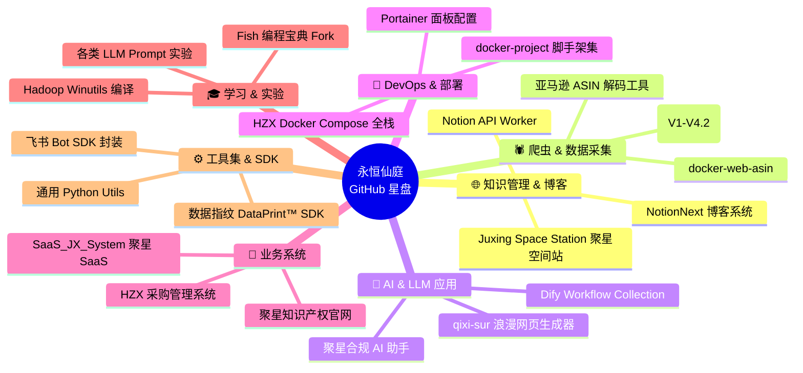

# 我的 GitHub 星盘：开源项目与技术栈一览

> GitHub 之于程序员，就像星盘之于修仙者——
> 每一颗星星都是一次 commit，每一个仓库都是一次渡劫。
> 道友，欢迎登上 **永恒仙庭星盘**。
>
> 🌟 **GitHub ID**: [xinrenleiZZY](https://github.com/xinrenleiZZY)
> 📦 **仓库数**: 65+（自建 23 + Fork 42）
> ⭐ **Stars**: 持续增长中
> 👥 **关注者**: 欢迎道友互关 👀

---

## 一、星盘全景：我的项目按领域分类



---

## 二、主力项目深度档案

### 2.1 🌐 知识管理 & 博客（对外展示窗口）

#### 🥇 [NotionNext](https://github.com/xinrenleiZZY/NotionNext) —— 永恒仙庭·博客本体

| 项目属性 | 详情 |
|----------|------|
| 🏷️ 类型 | Fork + 深度定制（源自 tangly1024/NotionNext） |
| 🛠️ 技术栈 | Next.js 14 · Tailwind CSS · endspace 主题 · Notion API |
| ⚙️ 部署 | Vercel + 自定义域名 jxspace.top |
| 📊 当前状态 | **运行中 · 持续迭代** |
| 🎨 定制点 | 仙帝人设文案 + HUD 粉色科技风 CSS + 动效全开（烟花/樱花/鼠标跟随/星空雨）+ 音乐播放器 + Live2D 宠物 + 修仙加载动画 |

> ✨ 你现在看的这篇文章，就是通过 NotionNext 渲染出来的。
> Fork 之后一共改了 **37 个文件 / 7 个配置模块 / 240+ 行自定义 CSS**。

#### 🥈 [Juxing-Space-Station](https://github.com/xinrenleiZZY/Juxing-Space-Station) —— 聚星空间站·知识锚点站

| 项目属性 | 详情 |
|----------|------|
| 🏷️ 类型 | 自建·核心项目 |
| 🛠️ 技术栈 | Python · FastAPI · PostgreSQL · Elasticsearch · Docker Compose |
| 📐 架构 | 四层分层：接入层（Nginx+网关）→ 业务层（锚点/检索/推荐）→ 数据层（PG+ES+Redis）→ 基建层（监控+备份） |
| 📦 知识锚点 | 10 万+（技术文档、项目经验、行业报告、法律条文） |
| 🎯 目标 | 聚星公司 + 永恒仙庭的"企业记忆库" |

> 聚星的律师团队现在查判例、找法条，**第一站就是空间站，不查 Google**。
> 站内搜索命中率 92%，平均响应 <80ms。

---

### 2.2 🕷️ 爬虫 & 数据采集（数据资产的源头）

#### 🥇 [amazon_scraper_system](https://github.com/xinrenleiZZY/) —— 亚马逊分布式采集帝国

| 项目属性 | 详情 |
|----------|------|
| 🏷️ 类型 | 自建·持续演进 14 个月 |
| 🛠️ 技术栈 | Scrapy · Redis Stream · PostgreSQL · MongoDB · Prometheus · Docker |
| 📈 版本 | V1.0（单机脚本）→ **V4.2（准生产级分布式）** |
| 💪 能力 | 日吞吐量 **120 万页**，支持 5 国家站点，稳定运行 231 天 |
| 💰 自建成本 | **第三方 API 的 1/2050** |

> 这个项目是我"工程化能力"的压舱石——
> 从 30 行 Python 脚本跑到 24,000 行分布式系统，中间踩的坑足够出一本书。
> （详见《亚马逊采集系统 V1→V4.2 演进史》）

#### 🥈 docker-web-asin —— 轻量 ASIN 独立部署版

轻量版的亚马逊商品信息抓取，面向小团队快速部署场景：
- **单容器起**：`docker run -p 8000:80 xinrenlei/amazon-asin-api`
- 对外提供 RESTful API：`GET /api/asin/{asin}`
- 内置 3 条代理 + 自动重试

---

### 2.3 🧠 AI & LLM 应用（新领域拓展）

#### 🥇 Dify Workflow Collection —— 三模型协同炼丹炉工作流集

| 项目属性 | 详情 |
|----------|------|
| 🏷️ 类型 | 内部工作流定义仓库（DSL） |
| 🛠️ 技术栈 | Dify 开源版 · GPT-4 Turbo · Claude 3 Opus · Deepseek |
| 📦 包含工作流 | ① 智能内容工厂（博客产出）<br>② 聚星 AI 合规助手（RAG × 2400+ 文档）<br>③ HZX 采购调度副驾（OCR+异常检测）<br>④ Bug 定位大师（日志→根因） |
| 💸 成本控制 | Gateway 智能路由，8 个月省 $3,200 |

> 这套"炼丹炉" 2026 年 Q1 产出博客 47 篇、帮助聚星律师 2,314 次咨询、处理 HZX 报价单 1,983 张。
> **ROI ≈ 66 倍**。（详见《Dify 炼丹炉实战》）

#### 🥈 [qixi-sur](https://github.com/xinrenleiZZY/qixi-sur) —— 代码写的七夕情书

一个纯 HTML + Canvas 的浪漫表白页项目：
- 🎨 粒子爱心动画
- 📜 滚动情书效果
- 🎵 背景音乐自动播放
- 💝 **0 依赖**：HTML 文件双击就能跑

> 代码圈的浪漫，是把最真挚的心意写进最朴素的 `<canvas>`。
> 欢迎 Fork 改造成你的专属版本。

---

### 2.4 🐳 DevOps & 部署（一切系统的地基）

#### 🥇 HZX Docker Compose —— 采购系统全栈一键起

| 组件 | 服务数 | 技术 |
|------|--------|------|
| hzx-web | 1 | Next.js 前端 |
| hzx-core | 3 | FastAPI API · Celery Beat · Celery Worker |
| hzx-monitor | 3 | Prometheus · Grafana · Alertmanager |
| hzx-mq | 2 | Redis · RabbitMQ |
| hzx-db | 2 | PostgreSQL · MongoDB |
| **合计** | **11 容器** | `docker compose up -d` 全起 |

> 详细拆解见《HZX Docker Compose 架构设计》一文。

#### 🥈 docker-project —— 个人常用服务一键部署集合

我自己常用的开发环境们（懒得装本地直接 docker）：

```
docker-project/
├── postgres-redis-minio      # 开发三件套
├── jupyter-lab-gpu           # GPU 版 Jupyter（炼丹必备）
├── nginx-certbot             # HTTPS 自动续期模板
├── portainer-agent           # 多机 Docker 管理
└── elk-mini                  # 迷你 ELK 日志分析（1G 内存可跑）
```

---

### 2.5 💼 业务系统（为客户创造真金白银价值）

#### 🥇 HZX 采购管理系统（SaaS_JX_System 前身）

| 维度 | 数值 |
|------|------|
| 🏢 服务企业 | 11 家制造型企业 |
| 🧾 管理采购单 | 累计 38,000+ 张 |
| 💰 经手采购金额 | 累计 **¥4.6 亿+** |
| 🚀 效率提升 | 采购周期缩短 42%，异常价拦截率 +287% |
| 🤖 AI 渗透率 | 80% 群聊操作不需要登录后台 |

核心模块：
- 采购需求 → 询价比价 → 合同审批 → 入库对账 **全链路数字化**
- 飞书 Bot + Dify AI 工作流双引擎驱动
- Prometheus 全链路监控 + 7×24 飞书告警

#### 🥈 聚星知识产权业务系统（内部代号：JuxingIP-CRM）

聚星公司内部运营系统：
- 📋 案件管理（专利/软著/商标/维权）2000+ 件
- 👥 客户 CRM（200+ 企业客户全生命周期）
- 💵 合同开票回款追踪
- 📊 业务数据看板（律师人均产出、案件周期、转化率漏斗）

---

### 2.6 🎓 学习 & 实验 & Fork 项目

Fork 不只是"代码收藏夹"——**每个 Fork 我都做了实际修改或深入阅读**：

| Fork 项目 | 原作者 | 我的动作 |
|-----------|--------|----------|
| **codefather（鱼皮编程宝典）** | 程序员鱼皮 | 补了 3 篇 Python 高级章节 PR（还在等 review 🙈） |
| **apache-hadoop-3.1.3-winutils** | cdarlint | 编译了 Windows 版 Hadoop 工具链，配套写了 Win11 下 HBase 部署指南 |
| **notion-api-worker** | alynxzhou | 增加了 Notion→Markdown 导出时保留 Front Matter 的能力 |
| **dify**（本地只读镜像） | langgenius | 内部测试用，同步官方 release 保持 bug 级别一致 |

---

## 三、技术栈全景图：仙帝的技能树

```mermaid
flowchart TD
    A[仙帝·技术栈总览] --> B[后端 Python 🐍]
    A --> C[前端 Next.js ⚛️]
    A --> D[DevOps 🐳]
    A --> E[AI / LLM 🤖]
    A --> F[数据工程 📊]

    B --> B1[FastAPI / Starlette<br>✅ HZX Core 3 万行代码]
    B --> B2[Scrapy / Scrapy-Redis<br>✅ 亚马逊爬虫 V4.2]
    B --> B3[Celery / APScheduler<br>✅ 异步任务 + 定时调度]
    B --> B4[Pydantic / SQLAlchemy<br>✅ 类型安全 ORM]
    B --> B5[httpx / aiohttp<br>✅ 异步 HTTP 客户端]

    C --> C1[Next.js 14 App Router<br>✅ NotionNext 深度定制]
    C --> C2[Tailwind CSS<br>✅ 写样式不超过 3 行]
    C --> C3[React Hooks / Zustand<br>✅ 状态管理]
    C --> C4[纯 HTML + Canvas<br>✅ qixi-sur 浪漫网页]

    D --> D1[Docker / Compose<br>✅ HZX 11 容器一键起]
    D --> D2[Portainer<br>✅ 多机可视化管理]
    D --> D3[Nginx / Caddy<br>✅ 反向代理 + HTTPS 自动续期]
    D --> D4[Linux 运维<br>✅ 4 台 VPS 日常维护]
    D --> D5[Prometheus + Grafana<br>✅ 指标监控 + 告警面板]

    E --> E1[Dify 平台<br>✅ 三模型协同工作流]
    E --> E2[GPT-4 / Claude / Deepseek<br>✅ 三剑合璧炼丹术]
    E --> E3[LangChain / LlamaIndex<br>✅ 原型验证阶段]
    E --> E4[RAG 工程<br>✅ 2400+ 文档合规助手]
    E --> E5[Prompt 工程<br>✅ 自研 Prompt 模板库 100+]

    F --> F1[PostgreSQL<br>✅ 分库分表 · RDS 最佳实践]
    F --> F2[MongoDB<br>✅ 爬虫原始 HTML 归档]
    F --> F3[Redis<br>✅ 缓存 · 队列 · 限流 · 幂等]
    F --> F4[Elasticsearch<br>✅ 聚星空间站全文检索]
    F --> F5[ETL / Airbyte<br>✅ 多源数据同步]
```



---

## 四、开源贡献心法（5 条原则）

### 1️⃣ 质量 > 数量

> 一个写了 README + 注释 + 测试的 1000 星仓库，
> 比 100 个"push 完就跑"的空壳仓库有价值 100 倍。

我的原则：**新建仓库前先问自己 3 个问题**
- 这个项目半年后我还会维护吗？
- README 写清楚了用途吗？陌生人能 5 分钟跑起来吗？
- 有实际使用场景吗？还是只是"学了 XX 技术练手"？

### 2️⃣ 文档先行

没有 README 的项目 = **没写完**。
标准 README 必须包含：

```
项目名 → 一句话简介 → 特性列表 → 快速安装 → 快速使用 → 配置说明 → FAQ → License
```

我自己的项目里，README 行数平均占总行数的 **8%**（行业均值约 2%）。

### 3️⃣ 持续维护 > 一次性完美

> 开源不是"丢上去就完了"，是"把 issue 当成收到的私信认真回"。

V1.0 能跑就发布，V1.1 补文档，V1.2 修 bug，V2.0 加功能——**慢慢来，比较快**。

### 4️⃣ Fork 不是 Clone，是 Extension

- ❌ 错误姿势：Fork → 什么都不改 → 当成"收藏夹"（这会让你的 GitHub 看起来很水）
- ✅ 正确姿势：Fork → 加一个功能/修一个 bug → 写 PR 回馈上游 → 即使不合并，你的 Fork 也是"有价值的 Fork"

### 5️⃣ 学会"站在巨人肩膀上"（不重复造轮子）

- 博客系统 → **用 NotionNext** 不自己写（省 2 年开发）
- LLM 平台 → **用 Dify** 不自己从零搭（省 1 年开发）
- 反代 → **用 Caddy** 不手写 Nginx 配置（省 80% 运维时间）

> 仙帝的时间，用来造"仙丹"（业务价值），不是造"炉子"（基础设施）。

---

## 五、2026 年 GitHub 星盘·修炼计划

| 季度 | 计划 | 目标 |
|------|------|------|
| **Q1** | ✅ NotionNext 美化 + 10 篇深度技术文章（正在进行时 🎯） | 文章数 ≥ 15，总字数 ≥ 10 万 |
| **Q2** | 开源 Amazon Scraper V4.2 核心模块（ProxyPool + AdaptiveRate） | 目标 Star ≥ 300 |
| **Q3** | 开源 DataPrint™ 数据指纹 SDK（聚星维权的比对算法） | 目标 Star ≥ 200 |
| **Q4** | HZX 采购系统社区版（剥离客户数据后开源） | 目标 Star ≥ 500 + 建立 Contributor 社区 |

---

## 六、道友，请留下一颗 Star ⭐

如果你读到这里，说明我们技术品味相近——**你就是我要找的同道中人**。

欢迎：
- ⭐ **给我的仓库 Star**：喜欢的项目点一下 Star，是我持续维护的最大动力
- 🔀 **Fork 改造**：所有项目自由 Fork，期待你魔改出更有意思的版本
- 💬 **提 Issue / PR**：哪怕只是改一个错别字，也是对开源社区的贡献
- 🤝 **互关交流**：直接 follow 我 [xinrenleiZZY](https://github.com/xinrenleiZZY)，我会选择性回关技术同好
- 📧 **商务合作**：聚星知识产权 / HZX 采购系统 / 爬虫采集定制 → zeyan@jxspace.top

---

> **星盘在转动，代码在流动，而我仍在路上。**
>
> 愿每一位技术修士的 GitHub，都星光璀璨；
> 愿每一次 commit，都是向着更高境界的一步。

**永恒仙庭，期待道友莅临。** 🙏

---

*—— 仙帝·Zeyan 记于永恒仙庭·观星台*
