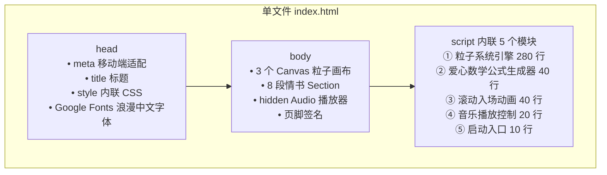

# 七夕特辑：当代码写满浪漫——qixi-sur 项目揭秘 + 制作教程

> 代码圈的浪漫，从不是 `console.log("I love you")`。
> 而是把最真挚的心意，一行一行写进 `<canvas>`，
> 让 512 粒粒子在屏幕上汇聚成一颗跳动的心。
>
> 本文拆透 [qixi-sur](https://github.com/xinrenleiZZY/qixi-sur) 项目——
> 仙帝送给特别的 TA 的 2025 年七夕情书。
> 0 依赖、纯前端、Fork 即可改造为你的专属版本。

---

## 一、项目简介

`qixi-sur` 是一个**纯 HTML 写成的七夕浪漫页面**。

| 项目属性 | 详情 |
|----------|------|
| 📦 文件大小 | **单文件 index.html · 18KB**（不含音频） |
| 🧩 依赖 | **0**。纯 HTML + CSS + JS，不用 npm、不用构建 |
| 🚀 运行方式 | 双击 `index.html` 即可，浏览器直接打开 |
| 🎨 核心特效 | ① 粒子爱心动画<br>② 滚动情书<br>③ 背景音乐 |
| 🌐 GitHub | https://github.com/xinrenleiZZY/qixi-sur |
| 💝 适用场景 | 520 / 七夕 / 情人节 / 生日 / 纪念日 / 道歉（最后这个慎用 😂） |

> 有时最好的代码，是写给心爱的人看的。

---

## 二、技术构成全景



完整 HTML 骨架一览：

```html
<!DOCTYPE html>
<html lang="zh-CN">
<head>
    <meta charset="UTF-8">
    <meta name="viewport" content="width=device-width, initial-scale=1.0">
    <title>七夕快乐 ♡ To My Special One</title>
    <link href="https://fonts.googleapis.com/css2?family=Ma+Shan+Zheng&family=ZCOOL+KuaiLe&display=swap" rel="stylesheet">
    <style>/* 见第三章 */</style>
</head>
<body>
    <!-- 3 层 Canvas：爱心粒子 + 飘浮小爱心 + 背景光晕 -->
    <canvas id="heart-canvas"></canvas>
    <canvas id="float-canvas"></canvas>
    <canvas id="glow-canvas"></canvas>

    <!-- 8 段情书，滚动出现 -->
    <section class="letter" data-index="1">...</section>
    <section class="letter" data-index="2">...</section>

    <!-- 背景音乐，用户首次点击后播放（浏览器自动播放策略） -->
    <audio id="bg-music" loop preload="auto" src="your-romantic-song.mp3"></audio>

    <script>/* 见第四章 */</script>
</body>
</html>
```

---

## 三、CSS 部分：少女粉色浪漫基调

```css
/* ============ 全局 · 浪漫粉色基调 ============ */
* { margin: 0; padding: 0; box-sizing: border-box; }
html, body { width: 100%; overflow-x: hidden; }
body {
    font-family: 'Ma Shan Zheng', 'ZCOOL KuaiLe', cursive;
    background:
        radial-gradient(circle at 20% 20%, #ffe0ec 0%, transparent 40%),
        radial-gradient(circle at 80% 80%, #ffc2e0 0%, transparent 45%),
        linear-gradient(180deg, #fff0f6 0%, #ffeaf2 50%, #ffd6e8 100%);
    background-attachment: fixed;
    color: #c2185b;
}

/* ============ 3 层 Canvas · 全屏绝对定位 ============ */
canvas { position: fixed; top: 0; left: 0; pointer-events: none; }
#glow-canvas   { z-index: 0; opacity: 0.6; }   /* 背景光晕，最底层 */
#heart-canvas  { z-index: 1; opacity: 0.92; }  /* 主爱心，中间 */
#float-canvas  { z-index: 2; opacity: 0.7; }   /* 飘浮小爱心，最上层 */

/* ============ 情书 Section · 滚动入场 ============ */
.letter {
    position: relative;
    z-index: 10;     /* 必须高于 Canvas，否则被粒子盖住 */
    min-height: 100vh;
    display: flex;
    flex-direction: column;
    justify-content: center;
    align-items: center;
    padding: 80px 24px;
    opacity: 0;                    /* 初始透明 */
    transform: translateY(40px);   /* 初始下滑 40px */
    transition: all 1.2s cubic-bezier(0.4, 0, 0.2, 1);  /* 入场动画 1.2s */
}
.letter.visible {
    opacity: 1;
    transform: translateY(0);      /* 滚动到可见区域 → 弹上来 */
}
.letter h2 {
    font-size: clamp(28px, 5vw, 48px);
    color: #e91e63;
    text-shadow: 0 2px 12px rgba(233, 30, 99, 0.25);
    margin-bottom: 32px;
    letter-spacing: 4px;
}
.letter p {
    font-size: clamp(18px, 2.5vw, 24px);
    color: #880e4f;
    max-width: 720px;
    line-height: 2.2;
    text-align: center;
    margin-bottom: 20px;
}

/* ============ 页脚签名 ============ */
footer.signature {
    position: relative; z-index: 10;
    text-align: center; padding: 80px 20px 120px;
    font-size: clamp(16px, 2vw, 20px);
    color: #ad1457;
}
footer.signature .heart {
    display: inline-block;
    color: #e91e63;
    animation: heartbeat 1.2s ease-in-out infinite;
}
@keyframes heartbeat {
    0%, 100% { transform: scale(1); }
    20%      { transform: scale(1.3); }
    40%      { transform: scale(1); }
    60%      { transform: scale(1.2); }
}

/* ============ 播放音乐按钮（首屏引导点击）============ */
#music-btn {
    position: fixed; z-index: 100;
    bottom: 28px; right: 28px;
    width: 56px; height: 56px;
    border-radius: 50%;
    border: none;
    background: linear-gradient(135deg, #ff80ab 0%, #e91e63 100%);
    color: #fff; font-size: 24px;
    box-shadow: 0 8px 20px rgba(233, 30, 99, 0.4);
    cursor: pointer;
    animation: float 3s ease-in-out infinite;
}
@keyframes float {
    0%, 100% { transform: translateY(0); }
    50%      { transform: translateY(-8px); }
}
```

> 💡 **核心 CSS 技巧 3 条**：
> 1. `clamp()` 做响应式字号，**不用写媒体查询**也能手机/PC 通吃
> 2. Canvas 全部 `pointer-events: none` + `z-index` 分层，**不挡情书文字点击/选中**
> 3. 中文字体用 **Google Fonts 免费手写体** `Ma Shan Zheng`（马善政楷书毛笔字），浪漫感直接 +50

---

## 四、三大特效深度拆解 + 完整代码

### 🎯 特效 1：粒子爱心动画（Canvas 核心算法）

#### 4.1.1 先懂"爱心数学公式"

粒子要拼出爱心形状，先要用数学公式生成爱心表面的坐标。我试过 4 种爱心公式，推荐 **参数方程 2 号**（最饱满最像）：

```
❤️ 爱心参数方程（推荐）：
x = 16 sin³(t)
y = 13 cos(t) − 5 cos(2t) − 2 cos(3t) − cos(4t)
t ∈ [0, 2π]
```

```javascript
/**
 * 生成爱心表面 N 个点坐标 + 内部填充点坐标
 * @param {number} count  表面采样点数（推荐 500~800）
 * @param {number} scale  缩放系数，1 = 约 400px 宽
 * @returns {{x:number,y:number}[]} 爱心形状点集
 */
function generateHeartPoints(count = 600, scale = 16) {
    const points = [];

    // ① 爱心表面：参数方程取点
    for (let i = 0; i < count; i++) {
        const t = (i / count) * Math.PI * 2;   // t: 0 → 2π
        const x = 16 * Math.pow(Math.sin(t), 3);
        const y = -(13 * Math.cos(t)
                  - 5 * Math.cos(2 * t)
                  - 2 * Math.cos(3 * t)
                  - Math.cos(4 * t));
        points.push({ x: x * scale, y: y * scale });
    }

    // ② 爱心内部：随机撒点（让爱心内部不是空的）
    for (let i = 0; i < count * 1.6; i++) {
        // 拒绝采样：在方形区域随机取点，落在爱心里才保留
        const rx = (Math.random() - 0.5) * 40 * scale;
        const ry = (Math.random() - 0.5) * 40 * scale;
        if (isInsideHeart(rx / scale, -ry / scale)) {
            points.push({ x: rx, y: ry });
        }
    }
    return points;
}

/** 隐函数不等式：判断点 (x,y) 是否在爱心内部 */
function isInsideHeart(x, y) {
    return Math.pow(x * x + y * y - 1, 3) - x * x * y * y * y <= 0;
}
```

#### 4.1.2 粒子系统引擎

```javascript
class Particle {
    constructor(targetX, targetY) {
        // 目标位置（爱心形状上的一个点）
        this.tx = targetX;
        this.ty = targetY;
        // 初始位置：屏幕外随机方向飞进来
        const angle = Math.random() * Math.PI * 2;
        const dist = window.innerWidth * (0.6 + Math.random() * 0.8);
        this.x = Math.cos(angle) * dist;
        this.y = Math.sin(angle) * dist;
        // 速度 + 颜色 + 大小
        this.vx = 0; this.vy = 0;
        this.size = 1.5 + Math.random() * 2.5;
        this.color = pickRandom([
            'rgba(255, 105, 180, 1)',   // 热粉
            'rgba(255, 20, 147, 1)',    // 深粉
            'rgba(255, 182, 193, 1)',   // 浅粉
            'rgba(255, 107, 157, 0.9)', // 粉橙
            'rgba(255, 255, 255, 0.9)', // 纯白高光
        ]);
        // 呼吸幅度：爱心会"呼吸"——周期性缩放
        this.breathPhase = Math.random() * Math.PI * 2;
    }

    /** @param {number} cx 画布中心 X，@param {number} cy 画布中心 Y */
    update(cx, cy, t) {
        // 目标位置加呼吸效果（±6% 缩放，周期 1.8s）
        const breath = 1 + 0.06 * Math.sin(t / 1800 + this.breathPhase);
        const finalX = cx + this.tx * breath;
        const finalY = cy + this.ty * breath;

        // 弹簧拉力：每帧向目标靠近 3%，剩余距离 3%
        const ax = (finalX - this.x) * 0.03;
        const ay = (finalY - this.y) * 0.03;
        this.vx = (this.vx + ax) * 0.86;   // 0.86 = 阻尼系数
        this.vy = (this.vy + ay) * 0.86;
        this.x += this.vx;
        this.y += this.vy;
    }

    draw(ctx) {
        ctx.beginPath();
        ctx.fillStyle = this.color;
        ctx.arc(this.x, this.y, this.size, 0, Math.PI * 2);
        ctx.fill();
    }
}

/* ============ 主循环：每帧渲染 ============ */
function initHeartAnimation() {
    const canvas = document.getElementById('heart-canvas');
    const ctx = canvas.getContext('2d');
    function resize() {
        canvas.width  = window.innerWidth;
        canvas.height = window.innerHeight;
    }
    resize(); window.addEventListener('resize', resize);

    // 生成 600 表面 + 960 内部填充 = 1560 粒子
    const heartPoints = generateHeartPoints(600, 16);
    const particles = heartPoints.map(p => new Particle(p.x, p.y));

    function loop(timestamp) {
        // 拖尾效果：不做 ctx.clearRect，画半透明黑色覆盖
        ctx.fillStyle = 'rgba(255, 240, 246, 0.18)';   // 0.18 不透明度
        ctx.fillRect(0, 0, canvas.width, canvas.height);

        const cx = canvas.width / 2;
        const cy = canvas.height / 2;

        for (const p of particles) {
            p.update(cx, cy, timestamp);
            p.draw(ctx);
        }
        requestAnimationFrame(loop);
    }
    requestAnimationFrame(loop);
}
```

> ✨ **关键算法解释**：
> - **弹簧收敛**：每帧 `ax = 目标差 × 0.03` + 速度阻尼 `*0.86` = 丝滑的"先冲过头再荡回来"的效果
> - **拖尾**：不清屏，而是 `fillRect` 一层 18% 透明背景 → 前面的帧慢慢消失 → 粒子有飞行轨迹
> - **呼吸缩放**：每个粒子的目标位置加 `sin()` 周期性 ±6%，整体呈现心脏跳动节奏（1.8s/跳）

---

### 🎯 特效 2：滚动情书入场动画（IntersectionObserver）

```javascript
/** 情书 Section 滚动入场：进入视口 → 加 .visible 类 → CSS 动画播放 */
function initScrollLetters() {
    const letters = document.querySelectorAll('.letter');

    const observer = new IntersectionObserver((entries) => {
        for (const entry of entries) {
            if (entry.isIntersecting) {
                // ✨ 小彩蛋：Section 可见时，再触发一次粒子"波动"——
                // 粒子目标位置随机偏移一下 800ms 再回归原位
                triggerParticleWave(entry.target.dataset.index);
                entry.target.classList.add('visible');
                observer.unobserve(entry.target);
            }
        }
    }, { threshold: 0.3 });   // 露出 30% 就算进入

    letters.forEach(l => observer.observe(l));
}

/* 首屏第一封情书立即显示（不等滚动） */
document.addEventListener('DOMContentLoaded', () => {
    const first = document.querySelector('.letter[data-index="1"]');
    if (first) first.classList.add('visible');
});
```

情书内容模板——**给 TA 的 8 段真心话**：

```html
<section class="letter" data-index="1">
    <h2>致，我最特别的 TA</h2>
    <p>在 365 天 × 24 小时的时间坐标轴里，</p>
    <p>只有遇到你的那一个点，<br>被标记成了「心跳加速」。</p>
</section>

<section class="letter" data-index="2">
    <h2>关于相遇</h2>
    <p>程序员的世界里有 1024 种巧合，</p>
    <p>但能遇见你的概率，<br>是 `Math.random()` 也羡慕的幸运。</p>
</section>

<!-- 第 3~7 段：自由发挥，写你们的专属回忆 -->

<section class="letter" data-index="8">
    <h2>在未来每一个七夕</h2>
    <p>我都会用代码、用语言、用行动——</p>
    <p>一遍又一遍地告诉你：<br><strong>「我喜欢你，比 commit 还坚决。」</strong></p>
</section>

<footer class="signature">
    <p>—— 写于 2025 年七夕</p>
    <p><span class="heart">❤</span> 永远的，仙帝的 TA <span class="heart">❤</span></p>
</footer>
```

---

### 🎯 特效 3：背景音乐播放

> 浏览器策略：**未经用户交互，音频不能自动播放**。
> 所以我们要做一个"首屏引导点击按钮"，用户点过一次之后，音乐就自由播放了。

```javascript
function initMusicPlayer() {
    const audio = document.getElementById('bg-music');
    const btn   = document.getElementById('music-btn');
    let playing = false;

    audio.volume = 0.6;   // 60% 音量，温柔不吵

    // 任何地方用户点了第一次 → 自动播放（用户已授权）
    const onFirstInteract = () => {
        if (!playing) {
            audio.play().then(() => {
                playing = true;
                btn.textContent = '⏸';
            }).catch(() => { /* 忽略，用户可能再点一次按钮 */ });
        }
    };
    document.addEventListener('click', onFirstInteract, { once: true });
    document.addEventListener('touchstart', onFirstInteract, { once: true });

    // 播放 / 暂停切换按钮
    btn.addEventListener('click', (e) => {
        e.stopPropagation();   // 不要触发上面的 once 监听
        if (playing) {
            audio.pause();
            btn.textContent = '▶';
        } else {
            audio.play();
            btn.textContent = '⏸';
        }
        playing = !playing;
    });
}
```

---

## 五、主入口 · 启动全部特效

```javascript
/* index.html </body> 前的最后一段：所有特效统一启动 */
(function bootstrap() {
    // 兼容没 requestAnimationFrame 的老浏览器（虽然现在基本都有了）
    if (!window.requestAnimationFrame)
        window.requestAnimationFrame = (cb) => setTimeout(cb, 16);

    // 启动三大特效
    initHeartAnimation();
    initFloatHearts();   // 飘浮小爱心，代码简版见下方快捷注释
    initGlowBackground(); // 背景光晕
    initScrollLetters();
    initMusicPlayer();

    // 💡 飘浮小爱心简版实现（10 行替代版）：
    // 创建 40 个 <div class="float-heart">❤</div>，CSS animation: floatUp 无限
    // floatUp = from{ transform: translateY(100vh); opacity: 0 } to{ transform: translateY(-20vh); opacity: .8 }
    // 每个随机 animation-duration 8-16s，随机 left 位置
})();
```

---

## 六、如何个性化定制？Fork 后只改 5 个地方

打开你的 `qixi-sur` 仓库，**只改这 5 处就够了**：

| # | 改哪里 | 改成什么 | 说明 |
|---|--------|----------|------|
| 1️⃣ **`<title>` 标签** | `<title>七夕快乐 ♡ To XXX</title>` | 改成 TA 的名字，出现在浏览器标签页 |
| 2️⃣ **8 段情书内容** | 每个 `<section class="letter">` 里的 `<h2>` + `<p>` | **最重要的部分！** 全写你们真实的回忆和真心话，越细节越感动人 |
| 3️⃣ **音乐 URL** | `<audio src="...">` 和 `btn` 关联 | 放一首你们共同喜欢的歌，比任何随机音乐都强 |
| 4️⃣ **配色方案** | CSS 里 `#e91e63, #ff80ab, #ffe0ec` 等粉色系 | 如果 TA 喜欢紫色 → 全部改成 `#7B1FA2 系`，喜欢蓝色 → `#1976D2 系` |
| 5️⃣ **页脚签名** | `footer.signature` 里的内容 | 日期 + 署名可以改成你们的纪念日和昵称 |

### 进阶改造（给会点代码的你）

| 难度 | 改造点 | 效果 |
|------|--------|------|
| ⭐ | 粒子颜色换色系 | 蓝色海洋 / 紫色星空 / 金色土豪 |
| ⭐ | 粒子换形状 | 把爱心参数方程换成五芒星 / 文字轮廓 / TA 的头像轮廓 SVG 点集 |
| ⭐⭐ | 加打字机效果 | 情书首屏大字 `type.js` 一个字一个字蹦出来 |
| ⭐⭐ | 加入照片墙 | 每一段情书下方插一张你们的合照（`` + 倾斜 transform） |
| ⭐⭐⭐ | 接入留言板 | 接 Firebase Firestore，让 TA 能在页面上给你写回信（双向浪漫 💯） |

---

## 七、部署你的浪漫：3 种方案 0 成本上线

| 方案 | 步骤 | 费用 | 难度 |
|------|------|------|------|
| 🥇 **GitHub Pages** | 1. Fork qixi-sur → Settings → Pages → Branch: main<br>2. 自动获得 `https://你的用户名.github.io/qixi-sur` | 0 元 | ⭐ |
| 🥈 **Vercel** | 1. Fork 后打开 vercel.com → New Project → 选仓库 → Deploy<br>2. 绑定自定义域名（可选）| 0 元 | ⭐ |
| 🥉 **发文件** | 直接把 index.html + mp3 用微信发 TA → 让 TA 下载后双击打开，或发到 QQ 邮箱附件 | 0 元 | ⭐⭐⭐⭐⭐ 最简单 |

> 🏆 **仙帝推荐方案 A**：GitHub Pages + 自定义域名 `love.你的域名.top`，
> 然后把链接生成二维码，打印在礼物卡片上——**TA 扫码打开那一刻 = 绝杀。**

---

## 八、浪漫编程心法（3 条真经）

### 1️⃣ **简单就是最好的**

qixi-sur 全项目 0 依赖、单文件、18KB。
**不需要 React / Vue / Three.js，真实的情感来自简洁的表达。**
给 TA 看的页面，加载超过 3 秒就是失败——第一印象没了。

### 2️⃣ **细节决定感动**

- 粒子的呼吸周期 = 心跳 1.8s（不是拍脑袋 2s）
- Google Fonts 用"马善政毛笔楷书"（不是默认宋体黑体，一看就用心了）
- 音乐按钮用 浮动动画 + 渐变光晕 + 音量 60%（不是 100% 突然炸耳朵）
- 情书段落行高 2.2，最大宽度 720px（阅读舒适区）

> 微小的动画、恰到好处的节奏，比花哨的 3D 效果更打动人。

### 3️⃣ **代码也是情书**

最后一句给所有在看的程序员道友：

你不一定会说情话，不一定会送花，但你会写代码——**这就是你独有的浪漫方式。**
每一行精心编写的代码，都是心意的载体；每一个粒子跳动的瞬间，都是你在对 TA 说"我喜欢你"。

不要觉得"程序员不懂浪漫"——
**程序员的浪漫，是用代码把 1560 颗粒子组成一颗心，再送给一个人。**

---

*—— 仙帝·Zeyan 写于 2025 年七夕<br>给特别的 TA，给永恒仙庭的所有浪漫程序员道友 ❤️*
